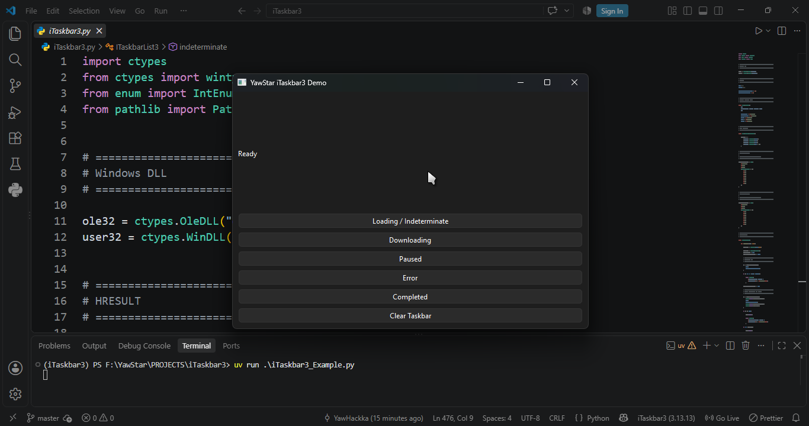

# iTaskbar3

[** English**](README.md) | [** Burmese**](README_MM.md)

A lightweight Windows Taskbar integration library for **PySide6** applications using the native Windows **ITaskbarList3 COM API**.

`iTaskbar3` allows PySide6 applications to control the Windows Taskbar progress indicator and display overlay icons for different application states such as downloading, paused, error, and completed.

---

## 📸 Screenshots



<video src="Screenshots/iTaskbar3_Demo.mp4" controls width="100%"></video>

---

## Features

- Native Windows `ITaskbarList3` support
- Taskbar progress bar
- Five Windows Taskbar progress states:
  - `TBPF.NO_PROGRESS`
  - `TBPF.INDETERMINATE`
  - `TBPF.NORMAL`
  - `TBPF.ERROR`
  - `TBPF.PAUSED`
- Taskbar overlay icons
- Downloading state
- Paused state
- Error state
- Completed state
- Loading / indeterminate state
- Progress value and maximum value support
- Automatic COM initialization and cleanup
- Native Windows `HWND` support through PySide6
- No additional Python package required for the Taskbar API
- Lightweight `ctypes` implementation

## Requirements

- Windows 10 or Windows 11
- Python 3.10+
- PySide6
- A Windows desktop environment

## Project Structure

```text
iTaskbar3/
│
├── iTaskbar3.py
├── iTaskbar3_Example.py
│
└── resources/
    ├── downloading.ico
    ├── paused.ico
    ├── error.ico
    └── completed.ico
```

## Installation

Install PySide6:

```powershell
pip install PySide6
```

If you are using `uv`:

```powershell
uv add PySide6
```

No additional package is required for `ITaskbarList3`.

## Basic Usage

Import the Taskbar class:

```python
from taskbar import ITaskbarList3, TBPF
```

Get the native Windows window handle from PySide6:

```python
hwnd = int(self.winId())

self.taskbar = ITaskbarList3(hwnd)
```

### Normal Progress

```python
self.taskbar.set_state(TBPF.NORMAL)
self.taskbar.set_progress(50, 100)
```

The Windows Taskbar will display approximately 50% progress.

### Indeterminate Progress

Use this when the application is busy but the exact progress is unknown:

```python
self.taskbar.set_state(TBPF.INDETERMINATE)
```

This is useful for operations such as:

- Loading
- Fetching metadata
- Connecting
- Preparing
- Processing

### Paused

```python
self.taskbar.set_state(TBPF.PAUSED)
self.taskbar.set_progress(50, 100)
```

### Error

```python
self.taskbar.set_state(TBPF.ERROR)
self.taskbar.set_progress(50, 100)
```

### Clear Progress

```python
self.taskbar.set_state(TBPF.NO_PROGRESS)
```

or:

```python
self.taskbar.clear_progress()
```

## Overlay Icons

`ITaskbarList3` can display a small overlay icon on the application's Taskbar icon.

### Downloading

```python
self.taskbar.set_overlay_icon(
    "resources/downloading.ico",
    "Downloading"
)
```

### Paused

```python
self.taskbar.set_overlay_icon(
    "resources/paused.ico",
    "Paused"
)
```

### Error

```python
self.taskbar.set_overlay_icon(
    "resources/error.ico",
    "Error"
)
```

### Completed

```python
self.taskbar.set_overlay_icon(
    "resources/completed.ico",
    "Completed"
)
```

### Remove Overlay Icon

```python
self.taskbar.clear_overlay_icon()
```

## Convenience Methods

`iTaskbar3` provides higher-level helper methods for common application states.

### Downloading

```python
self.taskbar.downloading(
    72,
    100,
    "resources/downloading.ico"
)
```

### Paused

```python
self.taskbar.paused(
    72,
    100,
    "resources/paused.ico"
)
```

### Error

```python
self.taskbar.error(
    72,
    100,
    "resources/error.ico"
)
```

### Loading

```python
self.taskbar.indeterminate(
    "resources/downloading.ico"
)
```

### Completed

```python
self.taskbar.completed(
    "resources/completed.ico"
)
```

### Reset

```python
self.taskbar.reset()
```

## Example State Flow

A downloader application can use the following state flow:

```text
          ┌──────────────┐
          │   Loading    │
          │ INDETERMINATE│
          └──────┬───────┘
                 │
                 ▼
          ┌──────────────┐
          │ Downloading  │
          │    NORMAL    │
          └───┬──────┬───┘
              │      │
        Pause │      │ Error
              ▼      ▼
        ┌────────┐ ┌───────┐
        │ Paused │ │ Error │
        └───┬────┘ └───────┘
            │
            │ Resume
            ▼
       ┌─────────────┐
       │ Downloading │
       └──────┬──────┘
              │
              │ Complete
              ▼
       ┌─────────────┐
       │  Completed  │
       │ ✓ Overlay   │
       └─────────────┘
```

## Taskbar Progress States

| State                |  Value | Description                 |
| -------------------- | -----: | --------------------------- |
| `TBPF.NO_PROGRESS`   | `0x00` | Hide the progress indicator |
| `TBPF.INDETERMINATE` | `0x01` | Progress is unknown         |
| `TBPF.NORMAL`        | `0x02` | Normal progress             |
| `TBPF.ERROR`         | `0x04` | Error state                 |
| `TBPF.PAUSED`        | `0x08` | Paused state                |

There is no dedicated `TBPF.COMPLETED` state. A completed operation can use:

```python
self.taskbar.set_state(TBPF.NO_PROGRESS)
self.taskbar.set_overlay_icon(
    "resources/completed.ico",
    "Completed"
)
```

## Resource Icons

Recommended overlay icon sizes:

```text
16 × 16
20 × 20
24 × 24
32 × 32
```

ICO files are recommended because Windows can select an appropriate icon size for the Taskbar.

Example:

```text
resources/
├── downloading.ico
├── paused.ico
├── error.ico
└── completed.ico
```

## Cleanup

Release the Taskbar COM object when the application closes:

```python
def closeEvent(self, event):
    self.taskbar.close()
    super().closeEvent(event)
```

The implementation also provides automatic cleanup through the destructor.

## Why ctypes?

`iTaskbar3` uses Python's built-in `ctypes` module to access the Windows COM interface directly.

This keeps the project lightweight and avoids requiring a separate Windows Taskbar wrapper package.

## Project Name

**iTaskbar3**

The name refers to the Windows `ITaskbarList3` interface used by this project.

## Platform

`iTaskbar3` is specifically designed for:

```text
Windows 10
Windows 11
```

It is not intended to provide Linux or macOS Taskbar/Dock APIs.

## 📜 License

This project is licensed under the MIT License - see the [LICENSE](LICENSE) file for details.

## 👤 About the Developer

Developed with ❤️ by **YawHackka**

- 🐙 GitHub: [@yawstar](https://github.com/yawstar)
- 📦 Repository: [iTaskbar3](https://github.com/YawStar/iTaskbar3)

## 🙏 Acknowledgments

- **QT6** - The Foundation Framework
- **Pyside6** - Python Bindings for Qt
- **IconArchive** - A Resource for Icons

---

<div align="center">

**[⬆ Back to Top](#-access-configurations)**

Made with 💚 by YawHackka

</div>
</div>
